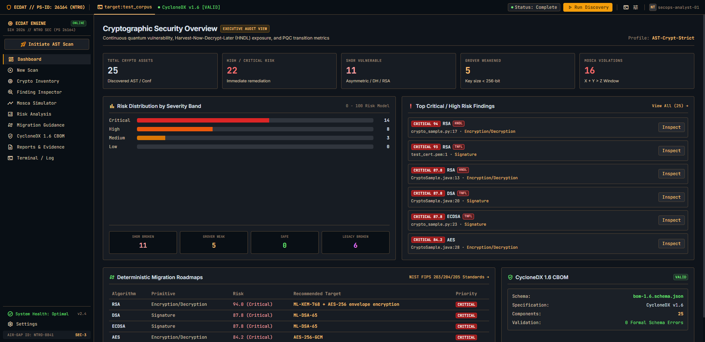

# Enterprise Cryptographic Discovery & Analysis Tool (ECDAT)
**SIH 2026 | PS ID: 26164 | NTRO**  
**Software Edition**  

---

ECDAT is an enterprise cryptographic discovery and analysis prototype for identifying cryptographic assets, classifying quantum exposure, evaluating migration timing, and producing CycloneDX CBOM evidence. The verified evaluation includes a controlled demo corpus, ground-truth measurements, and scans of OpenSSL, CPython, and OpenSSH.

**Live demo:** https://ecdat-sih-2026.vercel.app/  
**Demo/video evidence:** https://drive.google.com/drive/folders/1Wmq3nGff2P4qEbl23E3n-kWzY5ClIipb

### Quick Start
1. Clone the repository.
2. Create and activate a Python virtual environment.
3. Install `requirements.txt`.
4. Install frontend dependencies with `npm install` in `frontend/`.
5. Run `python run.py`.

---

## 🛡️ 1. What ECDAT Does

ECDAT is a cybersecurity and Post-Quantum Cryptography (PQC) readiness prototype for discovering cryptographic assets, analyzing quantum risk, generating PQC guidance, and producing CycloneDX CBOM evidence. It enables defense and intelligence organizations to:

1. **Discover Cryptographic Assets:** Scan supported source code, manifests, certificates, keystores, configuration files, and Java bytecode using the implemented offline scanners.
2. **Standardize into a Cryptographic Bill of Materials (CBOM):** Generate CycloneDX 1.6 CBOM output and validate it against the project schema.
3. **Classify Post-Quantum Vulnerability:** Classify findings into the project's quantum-status categories, including Vulnerable, Weakened, Legacy-broken, and Safe.
4. **Evaluate Threat Surface (HNDL / TNFL):** Distinguish between Harvest-Now-Decrypt-Later (confidentiality) and Trust-Now-Forge-Later (authenticity/signatures).
5. **Simulate Mosca's Inequality:** Interactively model $X + Y > Z$ (Data Lifetime + Migration Time vs CRQC Arrival Horizon).
6. **Prioritize Explainable Risk:** Present explainable risk results using the project's configured risk model.
7. **Deliver Actionable Migration Guidance:** Provide PQC migration recommendations based on the finding and configured guidance rules.
8. **Export Multi-Format Deliverables:** Produce CBOM JSON, SARIF 2.1.0 (for GitHub / IDE code scanning), Executive HTML Reports, ReportLab A4 PDF reports, CSV inventories, and Markdown summaries.
9. **Dedicated React Workstation:** Provide a React, TypeScript, Vite, and Tailwind-based interface for scan results and evidence.

---

## 🏛️ 2. Architecture & Pipeline

```text
┌────────────────────────────────────────────────────────────────────────┐
│               REACT + TYPESCRIPT + VITE STITCH WORKSTATION             │
│                       (Port 5173 / Localhost)                          │
│                                                                        │
│   • Dashboard             • Finding Inspector      • CBOM Inspector    │
│   • New Scan Pipeline     • Mosca Simulator        • Terminal & Log    │
│   • Crypto Inventory      • Risk Analysis          • Settings / Policy │
│   • Migration Guidance    • Reports & Evidence                         │
└───────────────────────────────────┬────────────────────────────────────┘
                                    │
                                    │ HTTP / REST APIs (JSON)
                                    ▼
┌────────────────────────────────────────────────────────────────────────┐
│                   FASTAPI ASYNC BACKEND ENGINE                         │
│                       (Port 8000 / Localhost)                          │
│                                                                        │
│   GET  /api/dashboard          GET  /api/risk      GET  /api/cbom      │
│   POST /api/scans              GET  /api/migration GET  /api/reports   │
│   GET  /api/inventory          GET  /api/findings  GET  /api/terminal  │
│   GET  /api/mosca              POST /api/mosca     GET  /api/settings  │
└───────────────────────────────────┬────────────────────────────────────┘
                                    │
                                    ▼
┌────────────────────────────────────────────────────────────────────────┐
│                 EXISTING PYTHON ECDAT ANALYSIS CORE                    │
│                                                                        │
│  PROJECT SOURCE ROOT / ARTIFACTS                                       │
│        │                                                               │
│        ├── Source Code (.py, .js, .java, .ts) ──► Python AST Visitor   │
│        ├── Manifests (requirements, pom, etc.) ──► Multi-Ecosystem     │
│        ├── Certificates (.pem, .der, .p12, .pub) ─► X.509 + Keystores  │
│        ├── Server Configs (nginx, openssl, etc.) ─► TLS Protocols      │
│        └── Java Bytecode (.class, .jar) ─────────► Offline Constant    │
│                                 │                                      │
│                                 ▼                                      │
│                 RAW FORENSIC EVIDENCE & NORMALIZATION                  │
│                 (File, Line, Rule ID, Snippet, Provenance)             │
│                                 │                                      │
│                                 ▼                                      │
│                 CROSS-SCANNER DEDUPLICATION                            │
│                 (Confidence upgrade & normalized usage)                │
│                                 │                                      │
│                                 ▼                                      │
│                 POST-QUANTUM CLASSIFICATION & HNDL/TNFL                │
│                 (Shor-Broken, Grover-Weakened, Legacy, Safe)           │
│                                 │                                      │
│                                 ▼                                      │
│                 MOSCA LIFETIME MODEL (X + Y > Z)                       │
│                                 │                                      │
│                                 ▼                                      │
│                 EXPLAINABLE RISK ENGINE (NTRO FORMULA)                 │
│                                 │                                      │
│                                 ▼                                      │
│                 PQC RECOMMENDATIONS (NIST FIPS 203/204)                │
│                                 │                                      │
│                                 ▼                                      │
│                 CYCLONEDX 1.6 CBOM SERIALIZATION & VALIDATION          │
│                                 │                                      │
│                                 ▼                                      │
│     MULTI-FORMAT DELIVERABLES (CBOM, SARIF, HTML, PDF, CSV, Logs)      │
└────────────────────────────────────────────────────────────────────────┘
```

---

## 🖥️ 3. All 11 Stitch Screens

The user interface completely replaces Streamlit with 11 custom-crafted workstation screens matching Stitch design specifications (`Project ID: 15951502437945520827`):

| # | Route | Screen Title | Key Capabilities |
|---|---|---|---|
| **1** | `/dashboard` | **Cryptographic Security Overview** | Hero KPI metrics, risk breakdown, quantum exposure distribution, recent findings list, quick scan CTA. |
| **2** | `/scan/new` | **New Scan Configuration** | Target path selection, multi-scanner checklist (Python AST, Java, Manifests, Certs, Configs), real-time 8-stage execution pipeline. |
| **3** | `/inventory` | **Crypto Inventory** | Searchable cryptographic asset table, multi-parameter filters (Algorithm, Quantum Status, Threat, Risk Band), pagination. |
| **4** | `/findings/:id` | **Finding Inspector** | Dual-column workbench: Asset Parameters, Shor/Grover impact, Mosca theorem check, Quantitative risk card, and IDE code viewer with syntax highlighting and highlighted vulnerable lines. |
| **5** | `/mosca` | **Mosca Simulator** | Interactive sliders for Data Lifetime ($X$), Migration Duration ($Y$), and CRQC Horizon ($Z$), presets (2030, 2035, 2040), real-time equation solving ($X + Y > Z$), HNDL verdict, and visual exposure timeline (2026–2040). |
| **6** | `/risk` | **Cryptographic Risk Analysis** | Global threat exposure gauge, full RFC-NTRO-892 mathematical formula breakdown, 5 weighted factor cards, top risk-ranked findings table. |
| **7** | `/migration` | **Post-Quantum Migration Guidance** | Bento metric cards, 3-stage architectural pipeline (Classical Vulnerable $\to$ Dual-Key Hybrid $\to$ Pure Post-Quantum Lattice), deterministic configured PQC transition rules. |
| **8** | `/cbom` | **CycloneDX 1.6 CBOM** | Real-time CycloneDX 1.6 schema verification banner, discovered components tree, live syntax-highlighted raw CBOM JSON viewer, export actions. |
| **9** | `/terminal` | **Terminal & Scan Log** | Live daemon telemetry stream, execution ID, log level filtering (ALL, INFO, SUCCESS, WARNING, CRITICAL), auto-scroll, regex filter, copy buffer, raw log export. |
| **10** | `/settings` | **Settings & Security Policies** | 7 configuration domains: AST parsers, quantum classification defaults, risk weights, CBOM schema strictness, air-gapped security guardrails. |
| **11** | `/reports` | **Reports & Evidence Deliverables** | 6 verified audit deliverables (Executive HTML, Technical Dossier, CSV Matrix, CBOM JSON, System Logs, Migration Plan), in-app live preview modal, verified download actions. |

---

## ⚙️ 4. Installation & Setup

### Prerequisites
- Python 3.10+ (Tested on Python 3.11, 3.12, and 3.14)
- Node.js 18+ & npm
- Git

### Quick Setup (Local Environment)
```bash
# Clone the repository
git clone https://github.com/shaikmohammedyasin-create/ECDAT-SIH2026.git
cd ECDAT-SIH2026

# Create and activate Python virtual environment
python -m venv venv
# On Windows PowerShell:
.\venv\Scripts\Activate.ps1
# On Linux/macOS:
source venv/bin/activate

# Install backend dependencies
pip install -r requirements.txt

# Install frontend dependencies
cd frontend
npm install
cd ..
```

---

## 🚀 5. Running ECDAT

### Option A: Single-Command Unified Launcher (Recommended)
```bash
python run.py
```
This automatically starts:
- **FastAPI Backend:** `http://127.0.0.1:8000` (Docs: `http://127.0.0.1:8000/docs`)
- **React Frontend:** `http://localhost:5173`
- Automatically opens your default web browser to the ECDAT Security Workstation!

### Option B: Independent Service Startup
**Terminal 1 (Backend API):**
```bash
python run.py --backend-only
# Or directly via uvicorn:
uvicorn backend.api.main:app --host 127.0.0.1 --port 8000 --reload
```

**Terminal 2 (React Frontend):**
```bash
cd frontend
npm run dev
```

---

## 📊 6. Supported Inputs & Manifests

| Category | Supported Formats | Scanner Implementation |
|---|---|---|
| **Python Source** | `.py` | AST Call-Site Visitor (`hashlib`, `RSA.generate`, `AES.new`) + Regex Fallback |
| **Java Source** | `.java` | Static Pattern Engine (`KeyPairGenerator`, `Cipher`, `Signature`, `MessageDigest`) |
| **JavaScript / TypeScript** | `.js`, `.ts`, `.jsx`, `.tsx` | WebCrypto and Node.js `crypto` API indicators (`createCipheriv`, `createHash`) |
| **Dependency Manifests** | `requirements.txt`, `pyproject.toml`, `pom.xml`, `package.json`, `package-lock.json`, `go.mod`, `Cargo.toml` | Offline manifest parsers with `defusedxml` protection |
| **Digital Certificates** | `.pem`, `.crt`, `.cer`, `.der` | Full X.509 metadata extraction (Algorithm, Key Size, Subject, Issuer, Validity) |
| **Keystores & Public Keys**| `.p12`, `.pfx`, `.pub` | PKCS#12 bundle parser & OpenSSH public key loader (**Zero private key storage**) |
| **Configuration Files** | `nginx.conf`, `sshd_config`, `openssl.cnf`, `.conf`, `.cfg` | TLS protocols, SSL cipher suites, DH parameter groups |
| **Java JVM Binaries** | `.class`, `.jar`, `.war` | Offline constant pool (`0xCAFEBABE`) static analyzer with Zip Slip containment |

---

## 📑 7. Reports & Deliverables

Every scan produces 6 standard deliverables in `output/`:

1. **`cbom.json`**: CycloneDX 1.6 Cryptographic BOM strictly validated against `schemas/bom-1.6.schema.json`.
2. **`inventory.csv`**: Tabular asset inventory with rule IDs, locations, quantum status, and risk bands.
3. **`findings.sarif`**: Schema-valid SARIF 2.1.0 output for automated CI/CD code scanning.
4. **`report.html`**: Standalone, dark-palette executive security report with interactive metrics.
5. **`report.pdf`**: Printable executive risk report built via ReportLab.
6. **`summary.md`**: Executive markdown summary suitable for commit comments and release notes.

---

## 🧪 8. Automated Testing & Verification

Run the full automated test suite:

    .\\venv\\Scripts\\python.exe -m pytest tests/ -v

### Verified Results
- **68 tests total:** 48 core, 15 API, and 5 hardening tests.
- **Ground-truth evaluation:** 37 true positives, 0 false positives, 1 false negative, and 15 true negatives; precision **1.0000**, recall **0.9737**, F1 **0.9867**.
- **Demo scan (`test_corpus`):** 25 assets (11 Shor-vulnerable, 5 Grover-weakened, 6 legacy-broken, 3 Quantum-safe), 16 Mosca violations, with 14 Critical, 8 High, and 3 Medium findings.
- **CycloneDX 1.6 CBOM:** 25 components and 0 schema errors on the verified demo scan.
- **External scans:** OpenSSL 3.3.0 (5,295 files, 1,295 findings), CPython 3.12.3 (4,636 files, 45 findings), and OpenSSH 9.7p1 (849 files, 205 findings); all recorded 0 CBOM schema errors.

---

## 🔒 9. Security Controls & Air-Gap Guarantee

- **Air-Gapped Operation:** Zero external network calls, tracking beacons, or telemetry.
- **Zero Private Key Persistence:** Scanners inspect algorithms and parameters only; never persist or log private keys.
- **Path Traversal Protection:** Target scan paths are sandboxed and validated against directory escape attacks.
- **Zip Slip & Archive Bomb Guard:** JAR and archive readers cap entry extraction and enforce safe path canonicalization.
- **XML Entity Defense:** Uses `defusedxml` to block XML external entity (XXE) and billion-laughs attacks.

---

## 🎬 10. Reproducible Demonstration Workflow

For a reproducible evaluator walkthrough:
1. Run `python run.py` and open the React workstation.
2. Scan `test_corpus` and review the dashboard and inventory.
3. Open a finding in **Finding Inspector** to inspect source evidence and quantum classification.
4. Review the **Mosca Simulator**, **Risk Analysis**, **Migration Guidance**, and **CycloneDX 1.6 CBOM** views.
5. Inspect the generated evidence and reports.

### Verified Demo Evidence

The verified `test_corpus` demonstration contains **25 assets** (**11 Shor-vulnerable**, **5 Grover-weakened**, **6 legacy-broken**, **3 Quantum-safe**), **16 Mosca violations**, **14 Critical**, **8 High**, and **3 Medium** findings. The resulting CycloneDX 1.6 CBOM contains **25 components** with **0 schema errors**.



**Live demo:** https://ecdat-sih-2026.vercel.app/

**Demo/video evidence:** https://drive.google.com/drive/folders/1Wmq3nGff2P4qEbl23E3n-kWzY5ClIipb

## Known Limitations

- True AST analysis is currently implemented for Python source; other source-language scanners use their implemented static pattern/parsing approaches.
- TLS and configuration analysis is the weakest scanner area and should be treated accordingly.
- Non-quantum risk factors use project defaults unless the user supplies different values.

## License

ECDAT is licensed under the [MIT License](LICENSE).
